## 📋 CBC概述与行业背景

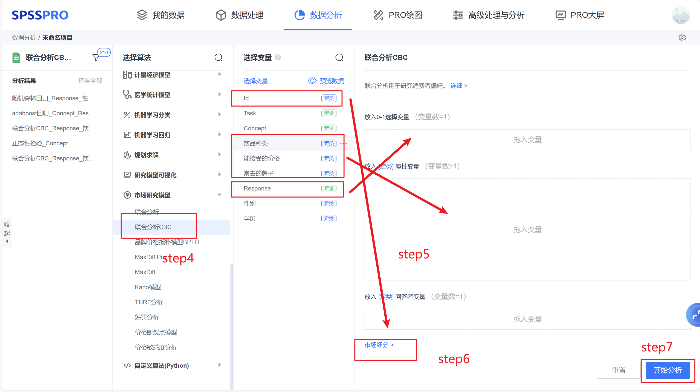

### 核心概念

Choice-Based Conjoint (CBC)分析，中文译为"基于选择的联合分析"，是一种市场调研中广泛使用的研究方法，用于理解个体如何在决策备选方案中发展偏好。CBC也被称为离散选择模型(Discrete Choice Modeling, DCM)或离散选择实验(Discrete Choice Experiments, DCE)。

### 核心特征与方法原理

#### 模拟真实决策

CBC是最广泛使用的基于调查的方法，用于理解和预测人们在面临具有挑战性的权衡时如何做出选择。这种方法模仿了受访者在现实世界中的权衡过程。

#### 理论基础

CBC基于随机效用最大化的假设，其本质也是一种离散选择模型。与传统联合分析方法相比，CBC具有更强的理论基础。

#### 方法原理

CBC通过让消费者在不同属性组合的产品之间进行多次选择，来发现消费者更看重哪些属性。输入：因变量为0-1选择变量；自变量为属性变量。

#### 适用场景

特别适用于产品开发前期分析，当需要分析下一代产品应该包含哪些功能或拥有什么样的外形时，CBC能够提供指导作用。

### 市场调研应用价值

CBC通过实验设计模拟所要研究产品/服务的市场竞争环境，测量消费者的购买行为，获知消费者如何在不同产品/服务属性水平和价格条件下进行选择。

#### 主要应用领域

- 新产品开发与创新
- 产品定价策略与价格弹性分析
- 品牌价值塑造与影响力评估
- 市场细分与消费者群体分析

### 技术发展历程与里程碑

#### 技术演进阶段

1. 早期联合分析阶段（传统自解释方法）
2. CBC的兴起与发展
3. 分层贝叶斯模型的突破
4. 自适应CBC(ACBC)的出现

#### 重要发展节点

| 年份 | 里程碑 |
|------|--------|
| 2000 | 产品线选择问题的数学建模 |
| 2006 | 图书馆服务开发应用 |
| 2010 | 眼动追踪技术结合 |
| 2013 | 医疗领域的首次应用 |
| 2020 | 医疗保健领域的标准化需求 |

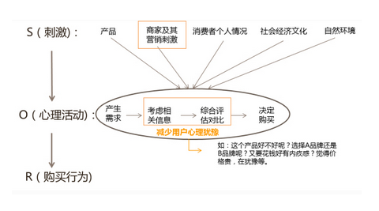

### 方法对比优势

#### 与传统方法对比

针对需要分析消费者权衡过程的问题，传统的市场研究往往只能作定性研究，而CBC可模拟现实生活中消费者的权衡过程，分析结果更加客观准确。

#### 技术优势

- 交互作用分析能力突出
- 真实性模拟购买者行为
- 数据处理更简单准确

### 行业定位与核心价值

#### 科学决策支持

CBC为商业决策提供了定量支持，能够为决策提供数据支撑。

#### 消费者洞察

CBC能够提供关于消费者偏好结构的更深入和更广泛的数据。

#### 市场预测

CBC研究开始依赖模拟器来预测均衡价格，用于战略决策。

---

## 🎯 核心概念与理论基础

### CBC分析的定义与核心思想

CBC（Choice-Based Conjoint Analysis），全称为基于选择的联合分析，也称离散选择分析，是一种用于研究消费者对产品或服务属性偏好的统计方法。

#### 基本假定

- 消费者根据构成产品/服务的多个属性进行感知和偏好判断
- 消费者对产品/服务的偏好不是基于单一因素，而是基于多个因素的结合来判断
- 直接询问消费者各属性的重要性是不现实甚至是无用的
- 需要模拟消费者在面对不同产品/服务组合时，参考多种属性结合效应后做出选择的过程

#### 核心理念与运作方式

CBC通过以下方式运作：

1. 提供给消费者不同属性水平组合形成的产品
2. 让消费者做出选择判断
3. 采用数理分析方法对每个属性水平赋值
4. 使评价结果与消费者选择保持一致
5. 分析研究消费者的选择行为

这是一个间接的测量过程，相比直接询问更真实地反映了消费者的实际选择行为。

### 基本概念体系

#### 属性（Attribute）

是指能够描述产品/服务重要特征的因素。在CBC分析中：

- 属性必须是影响消费者购买决策的关键因素
- 一个典型的联合分析包含6-7个显著因素
- 属性的确定需要经验、管理直觉和定性研究的支持

#### 水平（Level）

是每个属性的具体取值或表现形式。例如：

| 属性类型 | 水平示例 |
|----------|----------|
| 品牌属性 | 品牌A、品牌B、品牌C |
| 价格属性 | 200元、250元、300元 |
| 产品属性 | 基础版、标准版、高级版 |
| 服务属性 | 较差、一般、较好 |

#### 轮廓（Profile）

是由不同属性水平组合构成的具体产品描述。例如：

- **轮廓1**：品牌A + 200元 + 基础版 + 一般服务
- **轮廓2**：品牌B + 250元 + 标准版 + 较好服务

每个轮廓代表一个完整的产品概念，消费者在不同轮廓间进行选择。

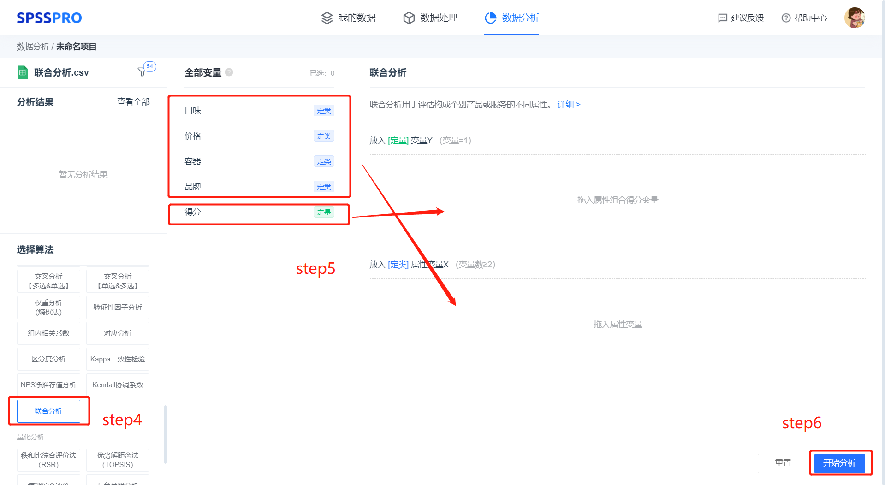

### 效用值与重要性权重

#### 效用值（Utility Value）

是联合分析中用来描述消费者对某一属性水平偏好的量化指标。它代表了：

- 消费者对某个属性水平的喜好程度
- 该属性水平对消费者总效用的贡献
- 不同属性水平之间的相对吸引力

##### 效用值的特性

- **相对性**：效用值是相对的，不是绝对值
- **零和性质**：同一属性下，各水平效用值之和为零
- **可比较性**：不同属性间的效用值可以进行比较

#### 重要性权重（Importance Weight）

反映各属性对消费者决策影响的相对重要程度。它表示：

- 某个属性在消费者整体决策中的权重
- 消费者在多大程度上根据该属性做出选择
- 不同属性对消费者偏好的相对影响

##### 重要性权重的计算方法

- **最大落差法**：计算某属性对应水平的最大效用值与最小效用值之差
- **相对重要度**：通过归一化处理计算属性的相对重要性百分比
- **总和为100%**：所有属性的相对重要性之和等于100%

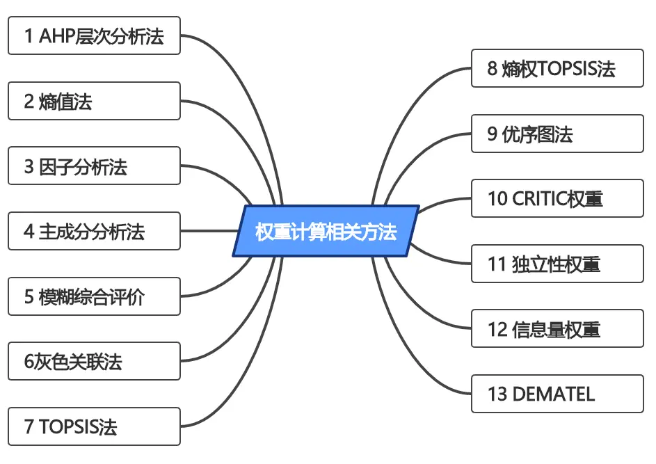

### 层级贝叶斯模型理论基础

#### 多层模型定义

多层模型（Multilevel Model）常被用于处理具有嵌套结构或层次结构的数据。典型的嵌套数据结构包括：

- 学生嵌套于学校中（第一层为学生，第二层为学校）
- 员工嵌套于组织中（第一层为员工，第二层为组织）
- 追踪数据中的时间点嵌套于个体中（第一层为时间点，第二层为个体）

#### 贝叶斯思想核心

贝叶斯方法与频率学派方法的本质区别：

| 学派 | 核心观点 |
|------|----------|
| 频率学派 | 将未知参数看作常数，根据样本参数估计总体参数 |
| 贝叶斯学派 | 将未知参数视为随机变量，分析的目的是得到参数的分布 |

在贝叶斯多层模型中，所有参数都被视为随机变量，研究者可以提供先验信息，结合先验信息和数据似然函数得到参数的后验分布。

#### 收缩效应（Shrinkage Effect）

层级贝叶斯模型的一个重要特征是收缩效应：

- **个体估计向总体均值收缩**：个体的估计会被"拉向"群体均值
- **减少估计误差**：虽然对个体产生了有偏估计，但预测误差更小
- **平衡个体与群体信息**：在个体信息和群体信息之间找到最佳平衡

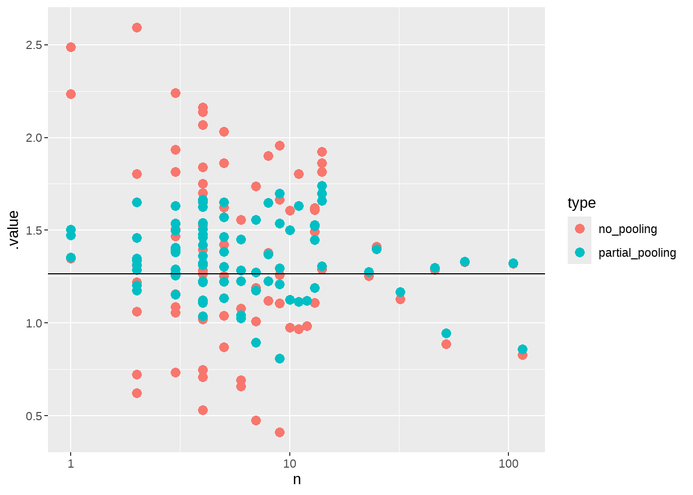

### 理论基础体系总结

#### 经济学理论基础

- 效用理论
- 选择理论
- 权衡理论

#### 心理学理论基础

- 认知负荷理论
- 信息处理理论
- 偏好形成理论

#### 统计学理论基础

- 回归分析
- 最大似然估计
- 贝叶斯推断

### 方法论价值与商业应用

#### 解决的核心问题

CBC分析解决了市场研究中的三个核心问题：

1. 测量消费者在多属性选择时的偏好
2. 确定消费者在多属性产品之间作出利弊选择
3. 模拟市场，开发消费者最喜欢的产品/服务

通过CBC分析，企业可以更好地理解消费者如何在属性间进行权衡，从而为产品开发、定价策略和市场定位提供科学依据。

#### 技术发展前沿

随着技术的不断发展，CBC分析正呈现深度融合发展态势：

- **AI技术融合**：深度学习、自然语言处理、强化学习
- **大数据技术融合**：多源数据融合、分布式计算
- **云计算平台**：弹性可扩展的计算资源
- **移动互联网**：支持随时随地的数据收集

#### 商业应用价值

CBC分析为市场调研和企业决策提供了独特的价值：

- **科学决策支撑**：量化偏好、预测能力、风险评估
- **竞争优势构建**：差异化洞察、快速响应、成本效率
- **产品开发价值**：概念筛选、配置优化、风险降低
- **营销策略优化**：价格敏感度分析、最优定价、精准营销

---

## 🔬 实验设计与方法论

### 实验设计流程概述

CBC（Choice-Based Conjoint）分析的实验设计是一个严谨的系统工程，需要经过多个关键步骤才能确保研究结果的科学性和有效性。完整的CBC实验设计流程包括：研究目标明确、属性水平筛选、实验设计类型选择、选择集构建、数据收集实施以及结果验证。

### 属性筛选原则

- **商业相关性**：必须对消费者决策产生实际影响
- **可操作性**：企业能够实际控制或改变这些属性
- **独立性**：各属性之间应尽可能保持统计独立性
- **全面性**：覆盖产品的所有关键维度

### 水平设置规范

- **水平数量**：通常每个属性设置2-5个水平为宜
- **水平间距**：差异应该具有实际意义且易于理解
- **现实可行性**：所有水平都应该是企业能够实际提供的
- **覆盖范围**：覆盖市场现有的全部可能取值

### 实验设计类型选择

#### 正交设计（Orthogonal Design）

- **统计效率**：能够独立估计每个属性的主效应
- **平衡性**：每个水平出现的频率相同
- **正交性**：属性之间无相关性，避免共线性问题
- **适用场景**：属性数量较少、研究预算有限的情况

#### 高效设计（Efficient Design）

- **精确性**：基于预研究或历史数据优化设计
- **灵活性**：能够处理属性之间的交互效应
- **效率性**：用更少的问卷数量获得更精确的参数估计
- **适用场景**：复杂产品、预算充足的研究项目

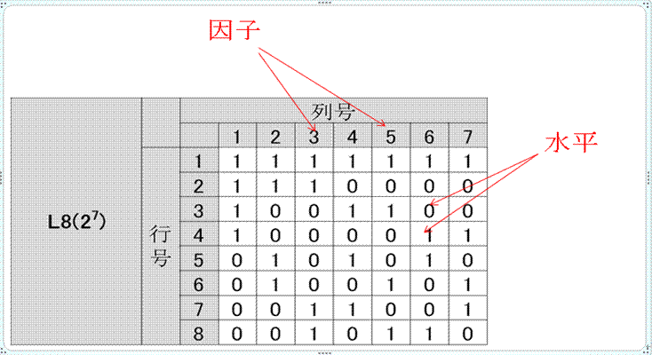

### 选择集的构建方法

#### 选择集设计原则

- **选项数量**：每个选择集通常包含3-5个产品选项
- **现实性**：所有选项都应该是市场可能出现的产品组合
- **无优势选项**：确保选择集中没有明显占优的选项
- **随机化**：选项位置和选择集顺序需要随机化以避免偏差

#### 问卷设计最佳实践

- **题目数量**：每个受访者通常完成8-12个选择任务
- **热身题目**：前1-2个题目作为热身，帮助理解任务
- **注意力检查**：设置验证题目确保受访者认真作答
- **说明清晰**：提供清晰的产品属性和水平说明

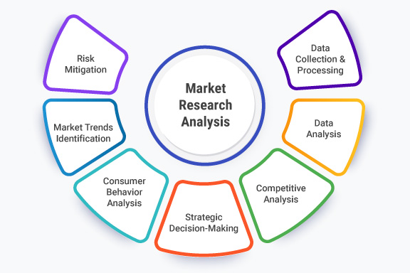

### 预测试与验证

- **小样本测试**：用20-30个样本测试问卷的可理解性
- **逻辑检查**：验证选择集设计是否合理
- **时间监控**：确保问卷完成时间在合理范围内
- **反馈收集**：收集受访者对问卷设计的建议

### 统计有效性检验

- **D-效率值**：评估设计的统计效率
- **平衡性检查**：验证各水平出现的频率
- **正交性验证**：确认属性之间的相关性
- **预测精度**：通过交叉验证评估设计的预测能力

### 实践案例分析

#### 智能手机产品研究

| 项目 | 内容 |
|------|------|
| 属性设置 | 价格（4水平）、品牌（3水平）、屏幕尺寸（3水平）、摄像头（3水平）、电池续航（3水平） |
| 设计选择 | 采用正交设计生成16个选择集 |
| 问卷结构 | 每个受访者完成10个选择任务 |
| 结果验证 | D-效率值达到95%，各项统计指标均达标 |

#### 汽车配置偏好研究

- **属性交互**：考虑价格与品牌的交互效应
- **条件属性**：某些属性只在特定条件下出现
- **分组设计**：对不同消费群体采用不同的实验设计
- **验证方法**：通过实际销售数据验证预测准确性

通过科学的实验设计，CBC分析能够为企业提供准确的市场洞察，指导产品开发、定价策略和营销决策，是现代市场研究中不可或缺的强大工具。

---

## 🛠️ 数据收集与分析工具

### CBC数据收集最佳实践

#### 实验设计核心原则

CBC实验设计建议包含2-8个属性，每个属性2-7个水平。属性定义应清晰简洁，避免技术术语。必须确保统计平衡设计，保证每个水平出现频率相近，并进行随机化处理减少顺序偏差。

#### 问卷设计考量

每个受访者完成8-20个选择任务，每个选择集包含3-5个产品概念。必须包含"无选择"选项模拟真实购买场景，避免过多选择任务导致受访者疲劳。

##### 样本量要求

每个细分市场需要100-200个有效样本，属性和水平越多，样本需求越大。

##### 数据验证方法

使用验证集检验模型准确性，检查逻辑一致性，监控完成时间。

##### 高级技术

自适应CBC动态调整问题，处理品牌-价格交互效应，使用视觉追踪技术。

### 主流CBC分析软件工具深度对比

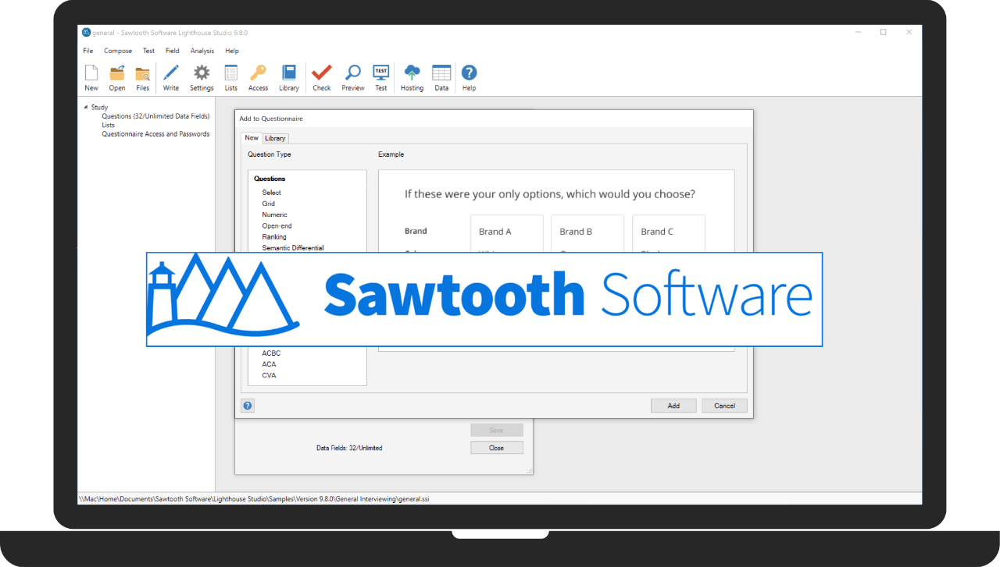

#### Sawtooth Software

**市场领导者 · 行业黄金标准**

- 30+年行业经验
- 分层贝叶斯(HB)分析
- What-if分析和市场份额预测
- 适合大型企业和复杂项目

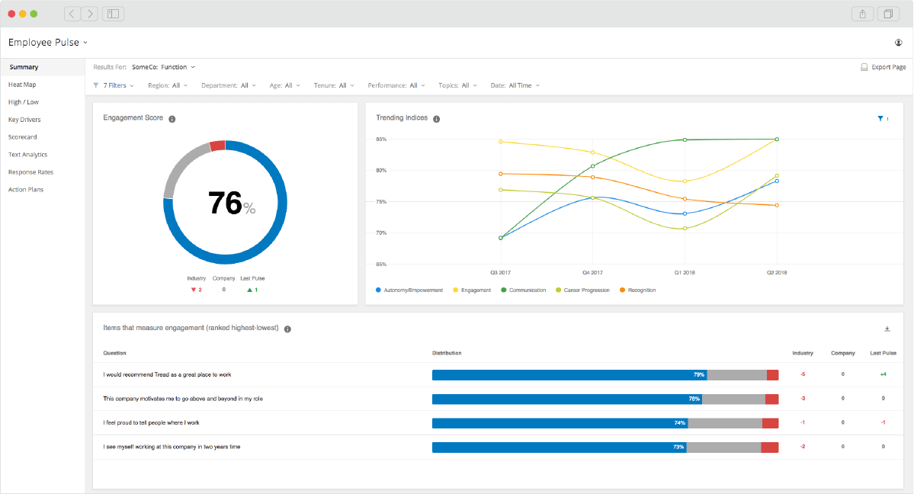

#### Qualtrics

**企业级解决方案 · 用户友好**

- 直观图形界面
- 自动生成平衡设计
- 支持移动设备适配
- 企业级集成解决方案

#### 其他工具对比

| 工具 | 特点 | 适用场景 |
|------|------|----------|
| OpinionX | 唯一提供真正免费CBC分析，无限参与者 | 预算有限团队 |
| SurveyKing | $19/月起，提供效用分析和市场份额模拟 | 中小型企业 |
| Conjoint.ly | 基础版免费（最多20回应），专业版$1,895 | 支持自适应CBC和MaxDiff分析 |

### 工具选择决策框架

#### 按预算选择

- **免费/低成本**：OpinionX
- **中等预算**：Qualtrics
- **高预算**：Sawtooth

#### 按用户类型

- **学术研究**：Sawtooth
- **企业团队**：Qualtrics
- **初创公司**：OpinionX

#### 按复杂度

- **简单**：OpinionX
- **中等**：Qualtrics
- **复杂**：Sawtooth

> **选择建议**：建议充分利用各供应商提供的试用版本进行实际评估，确保工具能够满足特定的研究需求和商业目标。

### 实施最佳实践与注意事项

#### 数据质量控制

- 正式投放前进行小规模预测试
- 提供适当激励确保参与度
- 识别并移除无效或低质量回应

#### 伦理和隐私考虑

- 确保受访者数据匿名化处理
- 参与完全自愿且可随时退出
- 采用安全的数据存储和传输方法

#### 未来发展趋势

AI集成提高自动化程度，云端SaaS模式转型降低部署成本，专业化细分提供行业定制解决方案，加强数据安全和合规性满足法规要求。

---

## 💼 商业应用场景分析

### 产品开发应用案例研究

#### 儿童手机产品开发案例

**背景介绍**：某企业研发儿童手机，通过CBC分析识别5个关键属性：价格、尺寸、网络定位功能、一键报警和英语翻译功能。

##### 研究设计

- 采用正交实验设计，5个属性每个属性2个水平，共8个实验轮廓
- 邀请12名被试，收集96行数据，采用打分法评估

##### 分析结果

| 指标 | 结果 |
|------|------|
| 属性重要性排序 | 英语翻译功能→尺寸→价格→一键报警→网络定位功能 |
| 关键发现 | 英语翻译功能效用值1.479（有）vs -1.479（无） |
| 尺寸偏好 | 3.7寸小手机更受欢迎 |
| 价格敏感度 | 1000元定位最优 |

#### 项目管理软件开发案例

**研究设计**：四个关键属性：价格水平（15/25/35美元）、集成能力（基础/高级/企业级）、用户界面（标准/可定制/AI驱动）、客服选项（仅邮件/电话+邮件/24/7高级客服）

##### 分析结果

- **属性重要性**：集成能力40%→价格30%→用户界面20%→客服选项10%
- **支付意愿**：高级集成功能+8美元，AI界面仅+3美元

### 定价策略应用深度分析

#### 品牌价格权衡模型（BPTO）应用

**模型概述**：BPTO是联合分析变种，专门用于品牌溢价测量

##### 实施方法

1. **数据采集**：构建不同价格水平产品组合
2. **模型构建**：成对比较类型离散选择模型（DCM）
3. **参数估计**：专业软件系统迭代拟合
4. **结果转换**：效用值转换为品牌溢价百分比

#### SUV市场定价案例

- **分析结果**：价格500元以下时市场份额最高，600元以上时面临竞品威胁
- **价格弹性洞察**：价格弹性绝对值越大，说明价格变化对需求影响越大

#### 定价策略优化价值

- **精准定价**：基于消费者真实偏好的价格设定
- **收益优化**：通过价格弹性格局优化收入结构

### 市场细分应用案例分析

#### 旅游市场细分案例

**背景**：西安市"农家乐"旅游市场，克服产品初级化和同质化现象

##### 细分结果

| 细分类型 | 特征描述 |
|----------|----------|
| 回归田园型 | 追求田园生活体验 |
| 静态休闲型 | 偏好安静放松环境 |
| 康乐健身型 | 注重健康和运动 |
| 娱乐参与型 | 喜欢参与娱乐活动 |
| 阳光运动型 | 热衷户外运动 |

### 品牌定位应用案例研究

#### 品牌溢价测量案例

**概念定义**：品牌溢价是消费者为钟爱品牌愿意额外支付的数额

##### 苹果iPhone案例

- 不到20%市场份额获得80%以上利润
- 连续多年福布斯最有价值品牌榜首
- 品牌溢价反映品牌资产积累

#### BenQ品牌战略启示

- **双轨并行可能性**：自有品牌和OEM/ODM业务可以兼顾
- **技术基础重要性**：优秀研发制造能力是坚实基础
- **亚洲市场机遇**：中国和印度需求增长形成巨大优势

### CBC分析商业应用价值总结

#### 核心价值体现

- 降低产品开发风险，提高成功率
- 优化定价策略，最大化收益
- 精准市场细分，提升营销效果
- 强化品牌定位，建立竞争优势

#### 成功关键因素

- 高层管理者支持与资源投入
- 专业数据分析与建模能力
- 跨部门协作与业务实际结合
- 持续学习与经验积累改进

> CBC分析在企业数字化转型中发挥重要作用，帮助企业建立基于数据的决策文化，在激烈市场竞争中获得持续优势。

---

## 📊 数据解读与洞察转化

### 核心指标解读框架

#### 效用值深度解读

效用值是CBC分析的核心指标，描述了消费者对产品属性水平的偏好得分。每个属性设有一个基准项（系数=0），其他水平的效用值反映了相对于基准的偏好程度。

- **高效用值属性水平** → 消费者最愿意为此付费的特性
- **效用值之和为零** → 反映了市场选择的相对平衡性
- **基准项设定** → 提供了相对比较的参考点

#### 属性重要性分析

包括传统极差法、数据效应方法（DE-AIM）和机器学习方法等先进技术。

**商业应用价值**：识别影响购买决策的关键驱动因素，指导资源优化配置和产品功能优先级排序

### 市场份额模拟器

市场份额模拟器利用效用值预测消费者在不同产品中的选择行为，通过Logit模型计算选择概率。

### 四层转化架构框架

| 层级 | 内容 |
|------|------|
| 数据理解层 | 关键指标识别、效用值分析、属性重要性排序、市场份额预测 |
| 商业解读层 | 意义阐释、将统计语言转化为商业语言、价值量化 |
| 策略制定层 | 战略方向选择、基于洞察确定产品定价定位策略、优先级排序 |
| 行动规划层 | 具体计划制定、明确责任人时间节点KPI、资源配置 |

### 产品开发决策转化

#### 需求洞察到产品设计

**转化流程**：效用值分析 → 需求优先级排序 → 产品功能设计 → 概念测试 → 产品开发

- 保留高效用值的功能特性
- 简化或移除低效用值的特性
- 平衡功能丰富性和成本控制

#### 产品线策略制定

基于细分市场偏好设计差异化产品，优化产品线结构避免内部竞争

### 定价策略转化

#### 价格敏感度评估

通过价格水平的效用值评估消费者支付意愿

#### 差异化定价体系

| 市场类型 | 定价策略 |
|----------|----------|
| 高敏感度市场 | 渗透定价 |
| 低敏感度市场 | 溢价定价 |
| 中等敏感度市场 | 价值定价 |

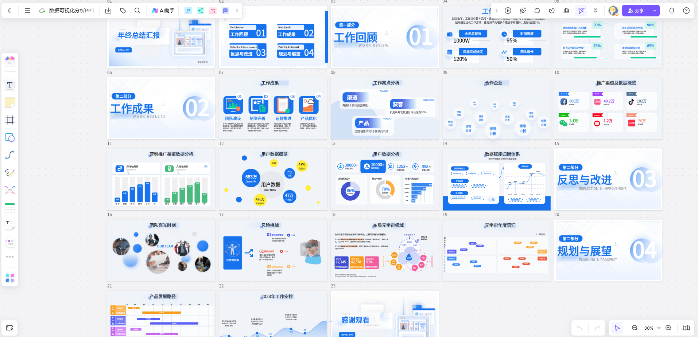

*市场调研数据分析仪表板展示多种数据可视化图表和业务指标*

### 成功案例深度分析

#### 消费电子产品案例

发现消费者对续航能力和拍照功能重视程度远超预期

- 研发资源重点投向电池技术和摄像头系统
- 调整定价策略，突出高价值功能
- 新产品上市后市场份额提升15%

#### 金融服务案例

发现不同客户群体对数字渠道和人工服务的偏好差异

- 为年轻客户提供数字化优先服务方案
- 为高净值客户提供个性化人工服务
- 客户满意度提升20%，交叉销售成功率提高25%

### 最佳实践与持续改进

#### 转化原则坚守

- 始终以商业价值为导向
- 确保洞察的可操作性和可执行性
- 建立持续的反馈和优化机制

#### 实施要点把握

- 加强跨部门协作和沟通
- 投资于人才培养和组织能力建设
- 建立系统化的流程和制度

#### 技术发展趋势

- **人工智能集成**：自动化实验设计和结果解释
- **大数据应用深化**：多源数据融合分析
- **实时决策支持系统开发**

---

## 🔮 优势局限与发展趋势

### CBC方法的核心优势分析

#### 方法论优势

- **真实性模拟**：模拟真实购买决策过程，比传统评级方法更接近现实购物行为
- **交互作用分析**：能够测量属性之间的交互作用，特别适用于价格研究与市场预测
- **市场预测能力**：利用效用值预测消费者选择，构建市场模拟模型

#### 商业价值优势

- **产品开发优化**：识别消费者最重视的属性特性，指导产品开发策略
- **定价策略指导**：分析价格敏感度，制定科学定价策略
- **市场细分支持**：根据消费偏好进行市场细分，制定精准营销策略

### CBC方法的局限性分析

#### 技术局限性

- **数据需求量大**：需要更大的样本量，个体层次效用估计不够可靠
- **设计复杂性**：需要精心设计以避免偏见，结果可能复杂且难以解释
- **应用限制**：不能解决所有问题，需要评估结果的信度和效度

#### 方法比较

与Adaptive CBC相比，标准CBC通常能够以更少的努力提供主要信息，但ACBC适合更复杂产品或深度洞察需求。选择方法取决于具体的研究目标和资源约束，两者各有优势。

### 机器学习与大数据的融合发展趋势

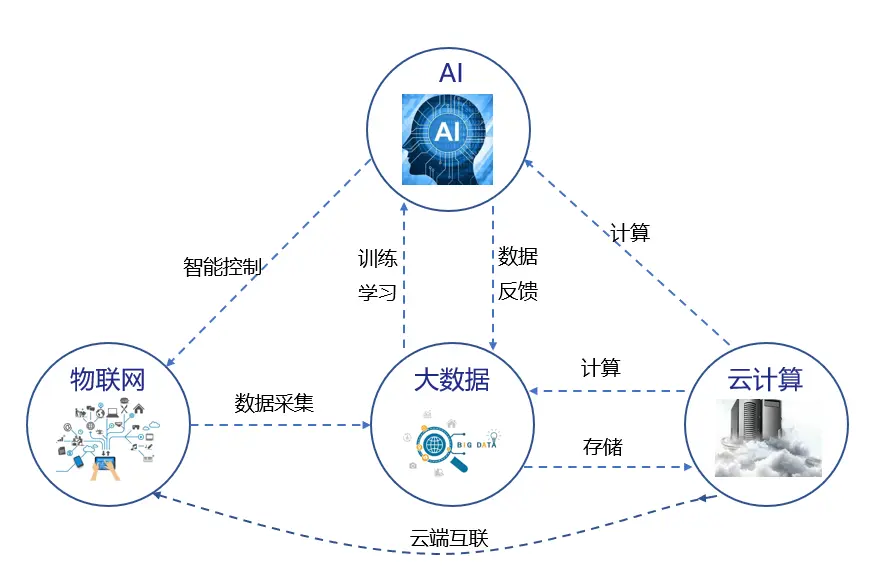

#### 技术应用优势

- **层次贝叶斯分析**：解决信息不足问题
- **支持向量机**：转化为分类问题处理
- **协同过滤**：借鉴推荐系统技术提高准确性

#### 大数据技术应用

- **数据规模优势**：基于更大样本进行分析
- **分布式计算**：Hadoop框架处理大规模数据
- **云计算集成**：提供灵活性和核心竞争力
- **实时分析**：支持实时市场洞察和决策响应

#### 智能化发展方向

- **自适应分析**：动态调整问题序列，提高数据收集效率
- **实时决策支持**：提供实时的市场洞察和动态定价
- **个性化推荐**：基于机器学习算法优化产品展示组合

### 数据隐私保护与伦理考量

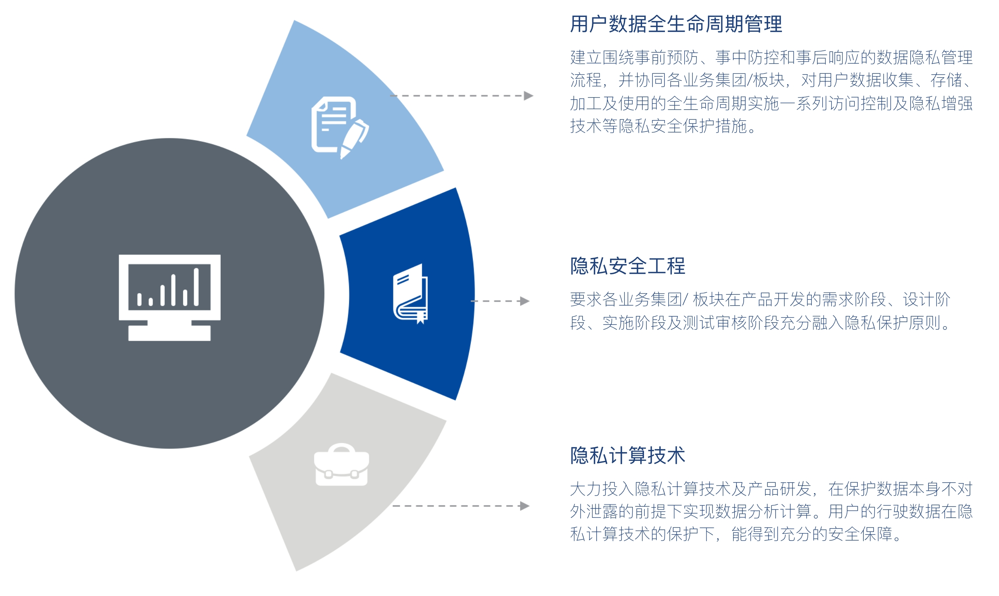

#### 隐私保护技术

- **多方安全计算**：不泄露私有数据完成协同计算
- **联邦学习**：无需交换私有数据协同训练模型
- **可信执行环境**：硬件级别安全保障
- **数据脱敏**：匿名化处理和合成数据技术

#### 法规合规

欧盟GDPR、美国算法问责法案、中国个人信息保护法等国际国内法规体系

#### 伦理原则

知情同意、算法公平性、数据最小化等伦理考量原则

#### 合规实践

分层同意、动态同意、情境化同意等改进机制

### 行业应用案例分析

#### 零售行业

**大型连锁超市定价优化**：

- 利润率提升2.3%
- 客户流失率降低15%
- 库存周转率提高18%

#### 金融行业

**银行产品创新**：

- 新产品成功率提升30%
- 客户保留率提高12%
- 交叉销售增长25%

#### 制造业

**汽车产品配置优化**：

- 配置合理性提升25%
- 客户满意度提高20%
- 制造成本降低8%

### 未来发展趋势与战略建议

#### 技术发展趋势

- **AI技术深度融合**：多模态学习、自动化机器学习、可解释AI
- **隐私保护技术发展**：联邦学习成熟、同态加密实用化、零知识证明
- **行业深度融合**：垂直解决方案、知识图谱构建、专业人才培养

#### 战略建议

- **技术投资**：加大对新技术平台的投资力度
- **人才建设**：培养既懂业务又懂技术的复合型人才
- **合规体系**：建立完善的数据合规和伦理治理体系
- **生态合作**：加强与技术服务商和学术机构的合作

---

## 📝 结论

CBC分析作为市场研究中的重要方法，在模拟真实购买行为、提供详细偏好洞察和支持商业决策方面具有显著优势。虽然存在数据需求量大、设计复杂等局限性，但通过机器学习和大数据技术的融合，这些局限性正在被逐步克服。

随着技术的不断发展和应用场景的不断拓展，CBC分析将在以下方面继续发展：

- **技术智能化**：AI与大数据深度融合
- **应用普及化**：更多行业和场景的应用
- **合规标准化**：数据隐私和伦理规范完善
- **生态开放化**：产学研合作深化

CBC分析将继续为企业的数字化转型和智能化升级提供强大支持，帮助企业在激烈的市场竞争中获得持续优势。

